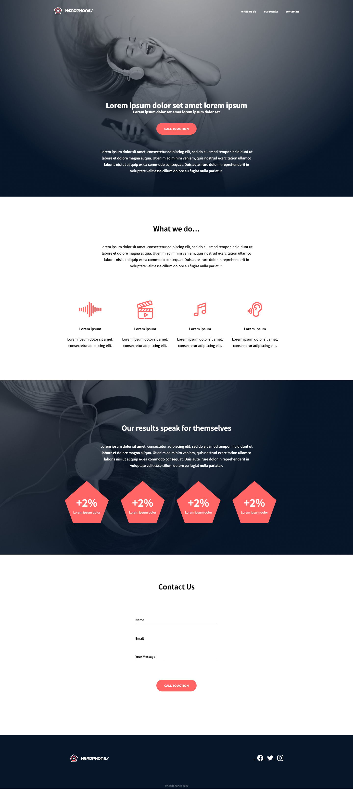
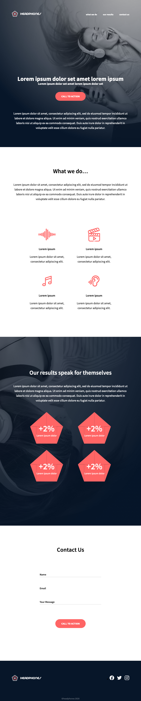

# 0x09. Implement a design from scratch

## Description
Project to design a static web page with HTML and CSS, based on this [Figma design](https://www.figma.com/file/gkWRcFqkwtruWZgSfnnHF0/Holberton-School---Headphone-company?node-id=0%3A1)

- The web page is developed from scratch, using no libraries or Javascript.
- The webpage switches to a mobile version for devices with a screen width of 140px or less.
- It's accessible and responsive
- Mainly using flexbox and css variables

## Final design
Here's how the website looks like:

### Desktop version

### Tablet version

## Mobile version

## Made by
* *Juan Amaya  Gaviria* - [GaviriaAmaya](https://github.com/GaviriaAmaya)
